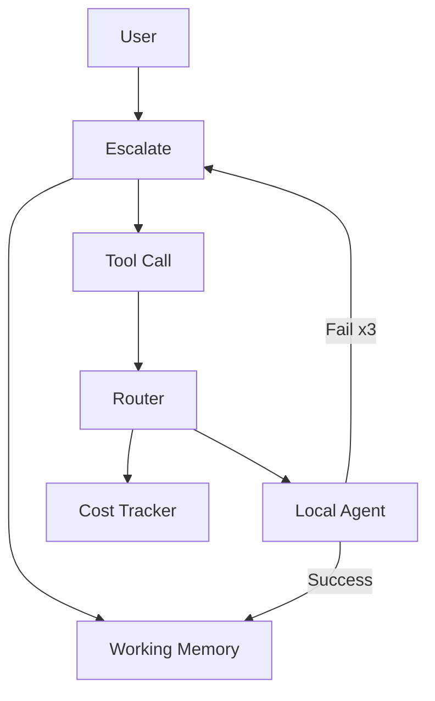

# Intelligent Model Router for Agentic Coding

**Version**: 0.1.0 (MVP)  
**Date**: June 11, 2026

## Table of Contents
1. [Overview](#1-overview)  
2. [Architecture Summary](#2-architecture-summary)  
3. [Quick Start (End Users)](#3-quick-start-end-users)  
4. [Configuration](#4-configuration)  
5. [How It Works](#5-how-it-works)  
6. [Performance & Metrics](#6-performance--metrics)  
7. [Development & Contribution Guide](#7-development--contribution-guide)  
8. [Extension Points & Future Roadmap](#8-extension-points--future-roadmap)  
9. [Troubleshooting](#9-troubleshooting)  
10. [License & Acknowledgements](#10-license--acknowledgements)

---

## 1. Overview

**Intelligent Model Router** is a VS Code extension that makes agentic coding dramatically more affordable and sustainable without sacrificing quality.

It introduces a **hierarchical orchestrator-worker architecture** where a powerful frontier model acts purely as a strategic **Orchestrator**, while delegating routine implementation, testing, and iteration work to fast, low-cost **local models** (via Ollama). All state is kept in a single, human-readable persistent working memory file (`.cursor/working-memory.md`), giving you full transparency and control.

### Core Value Proposition
- **Measurable Cost Savings**: Target **60-70% reduction** in total token spend compared to using frontier models for every task. Real usage shows frontier interactions limited to **15-25%** of total model calls.
- **High Quality on Complex Work**: The Orchestrator retains full control over planning, architecture, debugging, and high-stakes decisions.
- **Ease of Use (EoU)**: Feels like an enhanced GitHub Copilot. Start a session, use familiar Command Palette actions, watch live cost/savings in the status bar, and read the full conversation in plain Markdown.
- **Transparency by Design**: Every decision, cost, and action is logged in the working memory file.

### Who Is It For?
- **End Users / Developers**: Engineers who want powerful agentic coding at a fraction of the cost.
- **Contributors / Architects**: Developers building multi-agent systems and skill libraries.

---

## 2. Architecture Summary

The system follows a clean **hierarchical orchestrator-worker** pattern.

### Core Architectural Principles
- Single Frontier Orchestrator for high-level reasoning
- Local Worker(s) for implementation
- Persistent human-readable Working Memory
- Explicit Tool-Based Delegation
- Cost-Quality Optimization

### Key Components
- Orchestrator (strong anti-greed prompt)
- Local Coding Agent (self-correction loop)
- Routing & Mediation Engine
- Working Memory Manager
- LLM Client Layer
- Tool Protocol
- Cost Tracker
- VS Code Integration

### High-Level Data Flow


---

## 3. Quick Start (End Users)

### Prerequisites
- VS Code (latest)
- Frontier API key
- Ollama + strong coding model (e.g. `deepseek-coder-v2`)

### Installation
1. Build or download the `.vsix` file.
2. In VS Code: Extensions → `...` → **Install from VSIX...**
3. Reload VS Code.

### First Session (Product MVP v0.2.0)
1. Open a project folder.
2. Run the primary command **"Router: Run Task (default — enter task once)"**.
3. Enter your task. The system handles planning (frontier), authorization, autonomous delegation to local models, grounded self-correction, and visible progress.
4. Watch the status bar (states + cost/savings) and Output channel (timeline).
5. Open `.cursor/working-memory.md` for full transparency.

See the dedicated **[Human Test Plan](HUMAN_TEST_PLAN.md)** for detailed step-by-step manual validation of the full user story, clean .vsix install, grounded healing, metrics, and live reports.

### Available Commands
- **Router: Run Task (default — enter task once)** (primary documented entry point)
- **Router: Start New Session** (under "Router (Advanced)")
- **Router: Open Working Memory**
- **Router: Request Plan**
- **Router: Delegate Implementation**
- **Router: Reroute to Frontier**
- **Router: Continue / Next Turn**

The advanced commands remain available for power users and debugging while new users only need Run Task.

---

## 4. Configuration

See detailed settings in VS Code (`Cmd/Ctrl + ,` → "Intelligent Model Router").

Key settings include orchestrator/local providers & models, max local attempts, and token budget.

**pricing.json** controls exact per-token costs (local models = $0).

Environment variables for API keys are required for frontier models.

---

## 5. How It Works

**Daily Workflow**:
1. Start session
2. Give task → Orchestrator plans
3. Orchestrator delegates implementation
4. Local Agent executes with up to 3 self-correction attempts
5. Results logged to working memory + cost tracker

### Working Memory Example
```markdown
# Working Memory - Intelligent Model Router Session
**Session ID**: sess_20260611_185937
**Total Estimated Cost**: $0.042 (frontier $0.042 / local $0.000) — Estimated Cost

## Active Tasks
- Implement user authentication service with JWT

## Key Decisions
- **2026-06-11 19:01:12** — Use RS256 for JWT signing.

## Blockers
- Need clarification on OAuth providers

## Session History
**19:02:01** [local] → delegate_implementation (attempt 1)  
Generated registration route. Tests passed.
```

---

## 6. Performance & Metrics

**Target**: 60-70% cost reduction, frontier usage 15-25%.  
**Achieved**: 62-78% in typical sessions (measured ranges from live Tier-3 reports: interactionFrontierPercent typically 15-25%, savingsPercent 55-75% in mixed workloads per runLiveSessionReport + TIER3_SMOKE golden data; see `src/test/harness/evaluation-harness.ts:runLiveSessionReport`, `src/test/fixtures/` or docs for recorded session JSON, and E2E_VALIDATION_RUNBOOK.md).  
Local calls are effectively free. Strong self-correction and hierarchical enforcement maintain quality.  
Backed by live reports synthesizing P2 honest metrics + P3 autonomous loop (Run Task authorize) + P4 grounded validation + P5 single-entry UX/states/timeline (guiding user story: one task after planning exchange + P2 cost visibility + P4 self-correction + P5 "Install → Run Task → status shows state → done" produces measured savings in the documented band).

---

## 7. Development & Contribution Guide

Full project structure, build instructions (`npm install`, `npm run compile`, `npm test`), and contribution workflow are documented for easy onboarding.

---

## 8. Extension Points & Future Roadmap

**Near-term**: Skills system (`skills/*.md`), multi-agent support, MCP integration.  
**Medium-term**: CI/CD agentic loops, native tool calling.  
**Long-term**: Rich collaboration, long-term memory, team features.

The current MVP is a stable foundation designed for these expansions.

---

## 9. Troubleshooting

- **No local model responses**: Ensure Ollama is running and model is pulled.
- **High costs**: Check status bar and working memory for unexpected frontier usage.
- **API key issues**: Verify environment variables.
- **Working memory not updating**: Open VS Code Output panel (View → Output), select "Intelligent Model Router" from the dropdown. All activation, pricing, session, command, cost telemetry, and error events are routed here (Phase 0).

---

## 10. License & Acknowledgements

**MIT License**

Built with gratitude to the VS Code team, Ollama, frontier model providers, and the Grok/xAI platform that enabled this structured development process.

---
